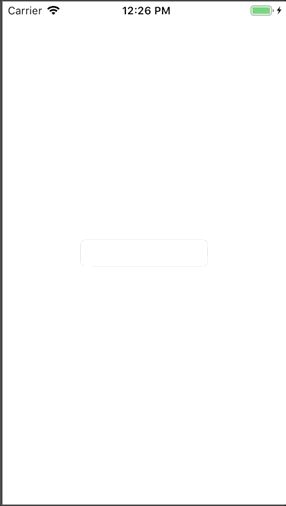

# SimpleReactive

SimpleReactive is my experiment for demonstrate reactive programming.

```swift
@IBOutlet weak var value2Display: UILabel!
let singal = SimpleColdSignal("")
override func viewDidLoad() {
    super.viewDidLoad()
    singal.bindTo(label: value2Display)
}
func textField(_ textField: UITextField, shouldChangeCharactersIn range: NSRange, replacementString string: String) -> Bool {
    let nsString = textField.text as NSString?
    let newString = nsString?.replacingCharacters(in: range, with: string)
    singal.next(newString ?? "")
    return true
}
```


[](https://travis-ci.org/chronicqazxc/simple-reactive)
[](http://cocoapods.org/pods/SimpleReactive)
[](http://cocoapods.org/pods/SimpleReactive)
[](http://cocoapods.org/pods/SimpleReactive)

## Example

To run the example project, clone the repo, and run `pod install` from the Example directory first.

## Requirements

## Installation

SimpleReactive is available through [CocoaPods](http://cocoapods.org). To install
it, simply add the following line to your Podfile:

```ruby
pod "SimpleReactive"
```

## Author

Wayne Hsiao, chronicqazxc@gmail.com

## License

SimpleReactive is available under the MIT license. See the LICENSE file for more info.
